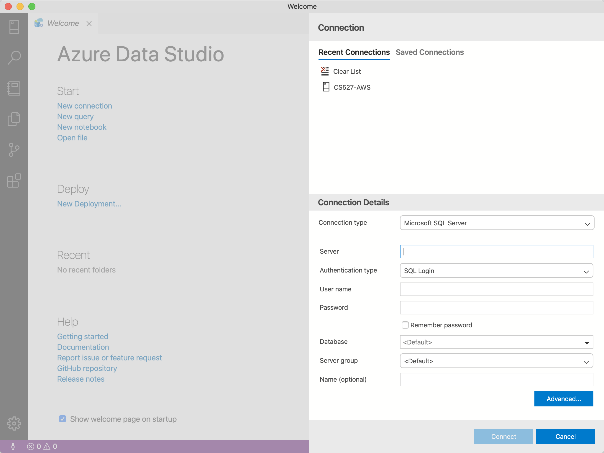
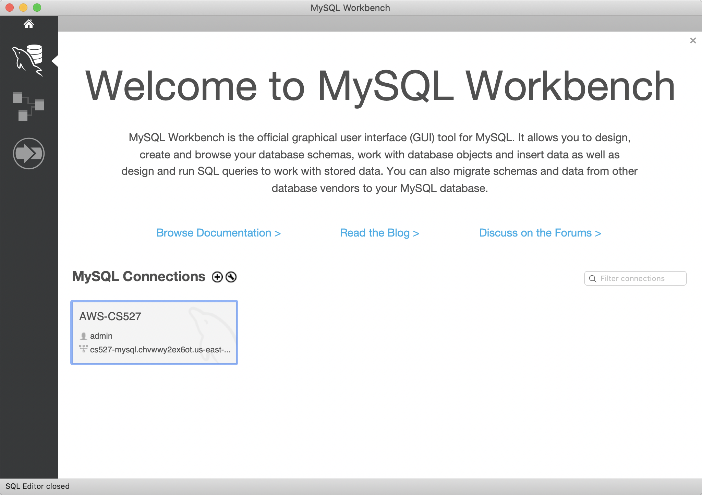
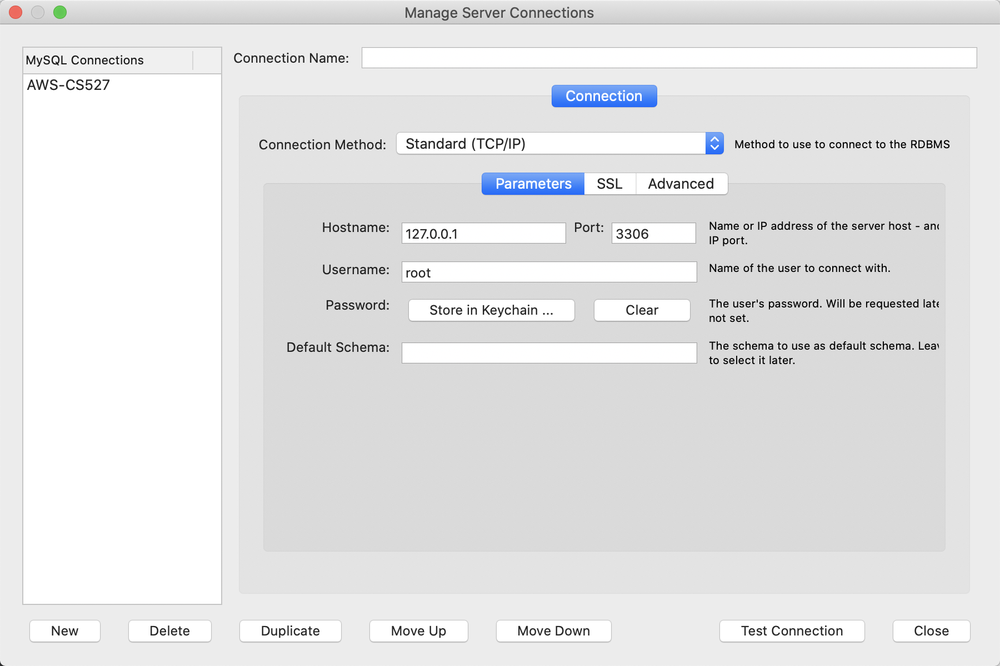

## Microsoft SQL Server - AWS

#### Preparation

Reference from AWS: [Amazon SQL Server User Guide](https://docs.aws.amazon.com/AmazonRDS/latest/UserGuide/USER_ConnectToMicrosoftSQLServerInstance.html)

Download [SQL Server Management Studio](https://docs.microsoft.com/en-us/sql/ssms/download-sql-server-management-studio-ssms?view=sql-server-ver15) if you are using Windows, otherwise, use [Azure Data Studio](https://docs.microsoft.com/en-us/sql/azure-data-studio/what-is?view=sql-server-ver15).

#### Connecting AWS using Azure Data Studio

1. Start Azure Data Studio

2. Use following parameters:

   Connection type: Microsoft SQL Server

   Server: cs527-mssql.chvwwy2ex6ot.us-east-2.rds.amazonaws.com,1433

   Authentication type: SQL Login

   User name: admin

   Password: password

   Database: \<Default>

   Server group: \<Default>

   Name (optional): (Whatever you like :stuck_out_tongue_closed_eyes:)

3. Click 'Connect'

4. It should work!!

#### Database Structure

* covid19

  Raw data(csv file) provided by professor.

* COVID_19_aggr

  Processed data accroding to requirements. It should be the outcome after question #3.

#### Table Structure

* covid19

| Id                 | Province_State     | Country_Region         | Date           | ConfirmedCases  | Fatalities      |
| ------------------ | ------------------ | ---------------------- | -------------- | --------------- | --------------- |
| Smallest, not null | nvarchar(50), null | nvarchar(50), not null | Data, not null | Float, not null | Float, not null |

* COVID_19_aggr

| Country_Region         | WeekOfYear    | ConfirmedDaily | FatalitiesDaily |
| ---------------------- | ------------- | -------------- | --------------- |
| nvarchar(50), not null | Int, not null | int, null      | int, null       |

## MySQL - AWS

#### Preparation

Reference from AWS: [Amazon MySQL User Guide](https://docs.aws.amazon.com/AmazonRDS/latest/UserGuide/CHAP_MySQL.html)

Download [MySQL Workbench](https://dev.mysql.com/downloads/workbench/).

#### Connecting AWS using MySQL Workbench

1. Start MySQL Workbench

2. Click 'Database' -> 'Manage Connection...' -> 'New'

2. Use following parameters:

   Connection Name: (Whatever you like :stuck_out_tongue_closed_eyes:)

   Connection Method: Standard (TCP/IP)

   Hostname: cs527-mysql.chvwwy2ex6ot.us-east-2.rds.amazonaws.com

   Port: 3306

   Username: admin

   Password: *Click 'Store in Keychain...' and use* 'password'

   Default Schema: \<null>

3. Click 'Test Connection'

4. It should work!!

5. Click 'Close'

6. Click 'Database' -> 'Connect to Database...'

#### Database Structure

* covid19

  Raw data(csv file) provided by professor.

* COVID_19_aggr

  Processed data accroding to requirements. It should be the outcome after question #3.

#### Table Structure

* covid19

| Id   | Province_State | Country_Region | Date | ConfirmedCases | Fatalities |
| ---- | -------------- | -------------- | ---- | -------------- | ---------- |
| INT  | VARCHAR(50)    | VARCHAR(50)    | Date | INT            | INT        |

* COVID_19_aggr

| Country_Region | WeekOfYear | ConfirmedDaily | FatalitiesDaily |
| -------------- | ---------- | -------------- | --------------- |
| VARCHAR(50)    | INT        | INT            | INT             |

